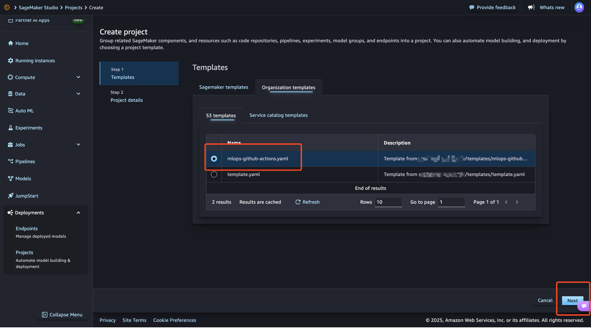
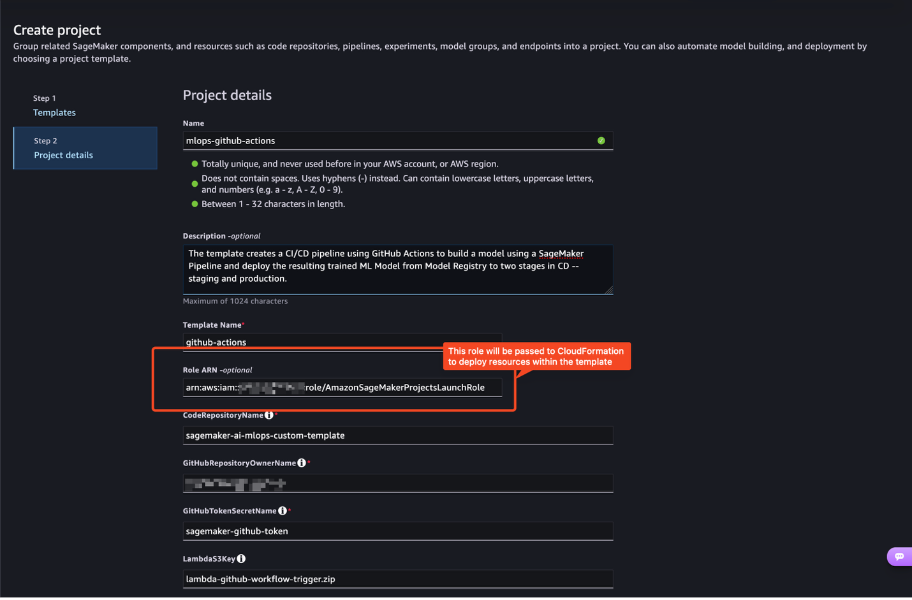

# MLOps using Amazon SageMaker and GitHub Actions (S3-Based Template)

This is an S3-based SageMaker project template that implements MLOps using Amazon SageMaker and GitHub Actions. This template has been migrated from the original Service Catalog-based approach to the new recommended S3-based deployment method.

## Overview

This template automates a model-build pipeline that includes steps for:
- Data preparation
- Model training  
- Model evaluation
- Registration in the SageMaker Model Registry
- Automated deployment to staging and production environments upon approval

## Architecture

The template creates the following AWS resources:
- **S3 Bucket**: For storing ML artifacts
- **Lambda Function**: Triggers GitHub workflows when models are approved
- **EventBridge Rule**: Monitors SageMaker Model Registry for approved models
- **SageMaker Code Repository**: Links to your GitHub repository
- **IAM Roles**: Proper permissions for Lambda execution

## Prerequisites

### 1. AWS CodeConnection Setup
Create a CodeConnection to your GitHub account following [this guide](https://docs.aws.amazon.com/dtconsole/latest/userguide/connections-create-github.html).

Your CodeConnection ARN will look like:
```
arn:aws:codeconnections:<REGION>:<ACCOUNT_ID>:connection/aEXAMPLE-8aad-4d5d-8878-dfcab0bc441f
```

Add the following tag to your connection 
```
key=sagemaker value=true
```


### 2. GitHub Personal Access Token
Create a GitHub personal access token with access to **Contents** and **Actions** permissions, following the instructions on [Managing your personal access tokens](https://docs.github.com/en/authentication/keeping-your-account-and-data-secure/managing-your-personal-access-tokens)

> Note: You can create either classic or fine-grained access token. However, make sure the token has access to the Contents and Actions (workflows, runs and artifacts) for that repository.

**[Fine-grained Personal Access Token (Recommended)](https://github.com/settings/personal-access-tokens):**
* Click "Generate new token" → "Fine-grained token"
* Repository access: Select "Only select repositories" → Choose sagemaker-ai-mlops-custom-template #or whatever your repo is
* Permissions:
    * Repository permissions:
        * ✅ Actions: Read and write
        * ✅ Contents: Read and write
        * ✅ Workflows: Read and write
* Click "Generate token"
* Copy the token (you won't see it again!)

**[Classic Personal Access Token](https://github.com/settings/tokens):**
* Click "Generate new token" → "Generate new token (classic)"
* Give it a descriptive name:SageMaker MLOps Lambda
* Select these scopes:
    * ✅repo(Full control of private repositories) - Required
    * ✅workflow(Update GitHub Action workflows) - Required
* Click "Generate token"

**then store it in AWS Secrets Manager.**

```bash
# Store GitHub token in Secrets Manager
aws secretsmanager create-secret \
    --name sagemaker-github-token \
    --description "GitHub token for SageMaker MLOps" \
    --secret-string '{"token":"your-github-token-here"}'
```

### 3. IAM User for GitHub Actions
Create an IAM user with the policy from [`iam/GithubActionsMLOpsExecutionPolicy.json`](./iam/GithubActionsMLOpsExecutionPolicy.json) and generate access keys for GitHub Secrets.

```bash
# Create IAM user
aws iam create-user --user-name sagemaker-github-actions-user

aws iam create-policy \
    --policy-name SageMakerGitHubActionsPolicy \
    --policy-document file://iam/GithubActionsMLOpsExecutionPolicy.json

aws iam attach-user-policy \
    --user-name sagemaker-github-actions-user \
    --policy-arn arn:aws:iam::$(aws sts get-caller-identity --query Account --output text):policy/SageMakerGitHubActionsPolicy

# Create access keys
aws iam create-access-key --user-name sagemaker-github-actions-user
```


### 4. Required IAM Roles and Policies (only once and used for all custom templates)

SageMaker Projects require a set of IAM roles that fall under two categories:

* `Use Roles` – Used within the template by each resource for the required operations. For each operation in the product template, the Use Role is assumed by the respective AWS Service Principal.
* `Launch Role` – Used to define permissions to provision the underlying resources specified by the template. This allows developers to create projects using templates without needing their SageMaker Execution Role to have all the policies needed. SageMaker Projects uses the launch role while creating the project so that the developers using the project can have their roles limited to the specific policies they need.

These are roles and policies assumed by the underlying services, e.g., AWS CodePipelines, AWS CodeBuild, AWS Lambda, to allow them to perform the actions needed.
Here are the list of service roles defined by this template:

- **AmazonSageMakerProjectsCloudformationRole** - Role for CloudFormation to manage SageMaker resources
- **AmazonSageMakerProjectsCodeBuildRole** - Role for CodeBuild projects to build and push container images
- **AmazonSageMakerProjectsCodePipelineRole** - Role for CodePipeline to orchestrate CI/CD workflows
- **AmazonSageMakerProjectsExecutionRole** - Role for SageMaker training and inference jobs
- **AmazonSageMakerProjectsLambdaRole** - Role for Lambda functions used in MLOps workflows
- **AmazonSageMakerProjectsUseRole** - General-purpose role for various SageMaker project services

Furthermore, it defines a "Launch Role" (**AmazonSageMakerProjectsLaunchRole**) that the SageMaker Execution role can assume.
In this way, the Launch Role encapsulates all necessary permissions without the need to extend the scope of the SageMaker Execution role directly.

Lets identify the SageMaker Execution role of the SageMaker user profile.
We intend to grant him permissions to deploy the provisioned custom template.

```bash
export SAGEMAKER_EXECUTION_ROLE_ARN=$(aws sagemaker describe-domain --domain-id $DOMAIN_ID --query 'DefaultUserSettings.ExecutionRole' --output text)
```

```bash
aws cloudformation deploy \
  --template-file iam/sagemaker-projects-roles-and-policies.yaml \
  --stack-name sagemaker-projects-roles-policies \
  --capabilities CAPABILITY_NAMED_IAM \
  --parameter-overrides SageMakerExecutionRoleArn=$SAGEMAKER_EXECUTION_ROLE_ARN \
  --region $AWS_REGION
```

This creates the necessary launch and execution roles that SageMaker projects require to provision resources securely.


### 4a. Additional Permissions
**SageMaker Execution Role**

Permission to `iam:PassRole` to `AmazonSageMakerProjectsLaunchRole`**

```bash
cat > iam/pass-role-policy.json << EOF
{
  "Version": "2012-10-17",
  "Statement": [
    {
      "Effect": "Allow",
      "Action": "iam:PassRole",
      "Resource": "arn:aws:iam::$(aws sts get-caller-identity --query Account --output text):role/AmazonSageMakerProjectsLaunchRole"
    }
  ]
}
EOF
```

```bash
aws iam put-role-policy \
  --role-name $(echo $SAGEMAKER_EXECUTION_ROLE_ARN | cut -d'/' -f3) \
  --policy-name SageMakerProjectsPassRolePolicy \
  --policy-document file://iam/pass-role-policy.json
```

Permission to create CloudFormation Stacks
```bash
aws iam put-role-policy \
  --role-name $(echo $SAGEMAKER_EXECUTION_ROLE_ARN | cut -d'/' -f3) \
  --policy-name SageMakerProjectsCreateCFNTemplates \
  --policy-document file://iam/cfn-stack-sm-projects.json
```
**S3 Tagging (optional)**
The default SageMaker execution role may be missing `s3:GetObjectTagging` permissions required by some templates. Add this permission:

```bash
aws iam put-role-policy \
  --role-name $(echo $SAGEMAKER_EXECUTION_ROLE_ARN | cut -d'/' -f3) \
  --policy-name SageMakerS3GetObjectTaggingPolicy \
  --policy-document file://iam/s3-tagging-policy.json
```

- **[sagemaker-projects-roles-and-policies.yaml](./iam/sagemaker-projects-roles-and-policies.yaml)** - Contains the necessary IAM roles and policies required by these templates
- **[s3-tagging-policy.json](./iam/s3-tagging-policy.json)** - Additional S3 GetObjectTagging policy for SageMaker buckets


### 5. Deploy Lambda Function

This lambda will trigger the deploy GitHub action on model registry approval

```bash
# Make the script executable and run it
chmod +x scripts/deploy-lambda.sh
./scripts/deploy-lambda.sh <your-lambda-s3-bucket> <REGION>
```

### 6. GitHub Repository Setup

#### Repository Structure
Copy the contents of the `seedcode/` directory to the root of your GitHub repository:
```
your-repo/
├── .github/
│   └── workflows/
│       ├── build.yml
│       └── deploy.yml
├── pipelines/
├── tests/
├── build_deployment_configs.py
├── deploy_stack.py
└── ... (other seedcode files)
```

#### GitHub Secrets
Add these secrets to your GitHub repository:
- `AWS_ACCESS_KEY_ID`: IAM user access key
- `AWS_SECRET_ACCESS_KEY`: IAM user secret key

#### Create GitHub Environment

1. Go to your repository **Settings** > **Environments**
2. Create environment named `production`
3. Add required reviewers for deployment approval

## Template Deployment

### S3 Upload and Tagging


1. **Upload template to S3:**
```bash
# <BUCKET> example sagemaker-*
aws s3 cp template.yaml s3://<BUCKET>/templates/mlops-github-actions.yaml

```

2. **Tag for SageMaker visibility:**
```bash
aws s3api put-object-tagging \
    --bucket <BUCKET> \
    --key mlops-github-actions/template.yaml \
    --tagging 'TagSet=[{Key=sagemaker:studio-visibility,Value=true}]'
```


3. **Configure SageMaker Domain:**
```bash
# Tag your SageMaker domain with template location
aws sagemaker add-tags \
    --resource-arn arn:aws:sagemaker:<REGION>:<ACCOUNT_ID>:domain/<DOMAIN-ID> \
    --tags Key=sagemaker:projectS3TemplatesLocation,Value=s3://<BUCKET>/templates/
```


### Method 1: Using SageMaker Studio

1. Open SageMaker Studio
2. Navigate to **More** > **Projects** > **Create project**
3. Choose **Organization templates** > **S3 Templates** . Select **MLOps GitHub Actions** template as shown below:
   
4. Fill in the parameters and create
   

   ⚠️ Important: Use the AmazonSageMakerProjectsLaunchRole ARN, not your SageMaker Execution Role.

The AmazonSageMakerProjectsLaunchRole is a provisioning role that acts as an intermediary during project creation. This role contains all the permissions needed to create your project's infrastructure, including IAM roles, S3 buckets, CodePipeline, and other AWS resources. By using this dedicated launch role, ML engineers and data scientists can create projects without requiring broader permissions in their own accounts. Their personal SageMaker Execution Role remains limited in scope—they only need permission to assume the Launch Role itself.

This separation of responsibilities is important for maintaining security. Without Launch Roles, every ML practitioner would need extensive IAM permissions to create CodePipeline, CodeBuild projects, S3 buckets, and other AWS resources directly. With Launch Roles, they only need permission to assume a pre-configured role that handles the provisioning on their behalf, keeping their personal permissions minimal and secure.


### Method 2: Python SDK

```python
import boto3

sagemaker_client = boto3.client('sagemaker', region_name='us-west-2')

response = sagemaker_client.create_project(
    ProjectName='mlops-github-actions-project',
    ProjectDescription='MLOps project using SageMaker and GitHub Actions',
    TemplateProviders=[{
        'CfnTemplateProvider': {
            'TemplateName': 'MLOpsGitHubActions',
            'TemplateURL': 'https://your-bucket.s3.region.amazonaws.com/mlops-github-actions/template.yaml',
            'Parameters': [
                {'Key': 'CodeRepositoryName', 'Value': 'your-repo-name'},
                {'Key': 'GitHubRepositoryOwnerName', 'Value': 'your-github-username'},
                {'Key': 'CodestarConnectionUniqueId', 'Value': 'your-connection-id'},
                {'Key': 'GitHubTokenSecretName', 'Value': 'your-secret-name'},
                {'Key': 'LambdaS3Bucket', 'Value': 'your-lambda-bucket'},
                {'Key': 'LambdaS3Key', 'Value': 'lambda-github-workflow-trigger.zip'}
            ]
        }
    }]
)
```

## Template Parameters

| Parameter | Description | Required | Default |
|-----------|-------------|----------|---------|
| `SageMakerProjectName` | Name of the SageMaker project | Yes | - |
| `CodeRepositoryName` | GitHub repository name | Yes | - |
| `GitHubRepositoryOwnerName` | GitHub username/organization | Yes | - |
| `CodestarConnectionUniqueId` | CodeConnection ID | Yes | - |
| `GitHubTokenSecretName` | Secrets Manager secret name | Yes | - |
| `GitHubWorkflowNameForDeployment` | Deployment workflow filename | Yes | deploy.yml |
| `LambdaS3Bucket` | S3 bucket with Lambda function | Yes | sagemaker-mlops-templates |
| `LambdaS3Key` | Lambda function S3 key | Yes | lambda-github-workflow-trigger.zip |

## Post-Deployment Configuration

After creating the project:

1. **Update GitHub Workflow Variables:**
   Edit `.github/workflows/build.yml` and `.github/workflows/deploy.yml`:
   ```yaml
   env:
     AWS_REGION: <REGION>  # Your AWS region
     SAGEMAKER_PROJECT_NAME: your-project-name  # Your project name
   ```

2. **Test the Pipeline:**
   - Make changes to the `pipelines/` directory
   - Push to your GitHub repository
   - Verify the build workflow runs automatically
   - Approve a model in SageMaker Model Registry
   - Verify the deployment workflow triggers

## Troubleshooting

### Template Not Visible in SageMaker Studio
- Verify the `sagemaker:studio-visibility` tag is set to `true`
- Check that the SageMaker domain is tagged with the correct S3 location
- Ensure proper CORS configuration on the S3 bucket

### Lambda Function Errors
- Verify the Lambda function zip file is uploaded to the correct S3 location
- Review CloudWatch logs for detailed error messages

### GitHub Workflow Not Triggering
- Verify the GitHub token has proper permissions
- Check that the secret name matches the parameter value
- Ensure the EventBridge rule is enabled and properly configured

## Security Best Practices

1. **Use least-privilege IAM roles**
3. **Rotate GitHub tokens regularly**

## Resources

- [Original Service Catalog Template](https://github.com/aws-samples/mlops-sagemaker-github-actions)
- [SageMaker Projects Documentation](https://docs.aws.amazon.com/sagemaker/latest/dg/sagemaker-projects.html)
- [S3-Based Templates Guide](https://docs.aws.amazon.com/sagemaker/latest/dg/sagemaker-projects-templates-custom.html)
- [GitHub Actions Documentation](https://docs.github.com/en/actions)

## License

This template is licensed under the MIT-0 License. See the LICENSE file for details.
